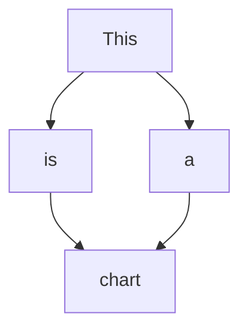

# The largest heading

## The second largest heading

###### The smallest heading

---

# Formatting text

## Simple formatting

**This is bold text**

*This text is italicized*

~~This was mistaken text~~

_This was underline text_

**This text is _extremely_ important**

***All this text is important***

\*this text is surrounded by literal asterisks\*

<sub>This is a subscript text</sub> <sup>This is a superscript text</sup>

## Quote

> Text that is a quote

> This is the first level of quoting.
>
> > This is nested blockquote.
>
> Back to the first level.

> This is a blockquote with two paragraphs. Lorem ipsum dolor sit amet,
> consectetuer adipiscing elit. Aliquam hendrerit mi posuere lectus.
> Vestibulum enim wisi, viverra nec, fringilla in, laoreet vitae, risus.
> 
> Donec sit amet nisl. Aliquam semper ipsum sit amet velit. Suspendisse
> id sem consectetuer libero luctus adipiscing.

> ## This is a header.
> 
> 1.   This is the first list item.
> 2.   This is the second list item.
> 
> Here's some example code:
> 
>     return shell_exec("echo $input | $markdown_script");

> Info
{.is-info}

> Success
{.is-success}

> Warning
{.is-warning}

> Error
{.is-danger}

<!-- This content will not appear in the rendered Markdown -->


## Links

This is [an example](http://example.com/ "Title") inline link.

[This link](http://example.net/) has no title attribute.

This is a internal link for [Code](#code) section.

## Emojy

All emojy on [this](emoji) page.

:smile: :joy: :yum: :+1: :ok_hand: :pray: :eye::lips::eye:

## Footnotes

Here is a simple footnote[^1].

A footnote can also have multiple lines[^2].  

You can also use words, to fit your writing style more closely[^note].

[^1]: My reference.
[^2]: Every new line should be prefixed with 2 spaces.  
  This allows you to have a footnote with multiple lines.
[^note]:
    Named footnotes will still render with numbers instead of the text but allow easier identification and linking.  
    This footnote also has been made with a different syntax using 4 spaces for new lines.

# Image


# Lists

## Unordered list

- George Washington
- John Adams
- Thomas Jefferson

## Ordered list

1. James Madison
2. James Monroe
3. John Quincy Adams

## Nested Lists

1. First list item
   - First nested list item
     - Second nested list item
2. Second list item
   - First nested list item
     - Second nested list item
       - Third nested list item

## Task lists

- [x] #739
- [ ] https://github.com/octo-org/octo-repo/issues/740
- [ ] Add delight to the experience when all tasks are complete :tada:
- [ ] \(Optional) Open a followup issue

## Collapsed sections

<details><summary>CLICK ME</summary>

#### We can hide anything, even code!

```ruby
   puts "Hello World"
```

</details>

## Math expression

This sentence uses `$` delimiters to show math inline:  $\sqrt{3x-1}+(1+x)^2$

The Cauchy-Schwarz Inequality

$$\left( \sum_{k=1}^n a_k b_k \right)^2 \leq \left( \sum_{k=1}^n a_k^2 \right) \left( \sum_{k=1}^n b_k^2 \right)$$

## Keyboard button

<kbd>⌘ ❖ ⌥ ⎇ ⌫ ⌦ ↩ ⌃ ⇥ ⇧ ⇪ ⇭ ⏎ ⌤ ▤ ⎋</kbd>

# Table

## Simple table

| First Header  | Second Header |
| ------------- | ------------- |
| Content Cell  | Content Cell  |
| Content Cell  | Content Cell  |

## Formatted table

| Command | Description |
| --- | --- |
| `git status` | List all *new or modified* files |
| `git diff` | Show file differences that **haven't been** staged |

## Align text

| Left-aligned | Center-aligned | Right-aligned |
| :---         |     :---:      |          ---: |
| git status   | git status     | git status    |
| git diff     | git diff       | git diff      |

# Code

## Inline code

This is a `code` text

``There is a literal backtick (`) here.``

## Code block

    This is a code block.

```shell
# Tisi is a code block
cd ~/you/can/select/the/language
ENV=of the code
$(pwd):like 8000:8000 shell, or ruby
```

````
```
Look! You can see my backticks.
```
````

```ruby
require 'rugged'
require 'linguist'

repo = Rugged::Repository.new('.')
project = Linguist::Repository.new(repo, repo.head.target_id)
project.language       #=> "Ruby"
project.languages      #=> { "Ruby" => 119387 }
```

```
You can also insert a very very long text and scroll right for view all the text. You can copy the text from the button on the right.
```

## Diagram



```diagram
PHN2ZyB4bWxucz0iaHR0cDovL3d3dy53My5vcmcvMjAwMC9zdmciIHhtbG5zOnhsaW5rPSJodHRwOi8vd3d3LnczLm9yZy8xOTk5L3hsaW5rIiB2ZXJzaW9uPSIxLjEiIHdpZHRoPSI0NDFweCIgaGVpZ2h0PSI3MjFweCIgdmlld0JveD0iLTAuNSAtMC41IDQ0MSA3MjEiIGNvbnRlbnQ9IiZsdDtteGZpbGUgaG9zdD0mcXVvdDtlbWJlZC5kaWFncmFtcy5uZXQmcXVvdDsgbW9kaWZpZWQ9JnF1b3Q7MjAyMi0wNi0wOVQxNTo0NToyNi41ODlaJnF1b3Q7IGFnZW50PSZxdW90OzUuMCAoV2luZG93cyBOVCAxMC4wOyBXaW42NDsgeDY0KSBBcHBsZVdlYktpdC81MzcuMzYgKEtIVE1MLCBsaWtlIEdlY2tvKSBDaHJvbWUvMTAzLjAuMC4wIFNhZmFyaS81MzcuMzYmcXVvdDsgZXRhZz0mcXVvdDt2NlAteTU2VVpjVW15V01UeWJ5SyZxdW90OyB2ZXJzaW9uPSZxdW90OzE5LjAuMyZxdW90OyB0eXBlPSZxdW90O2VtYmVkJnF1b3Q7Jmd0OyZsdDtkaWFncmFtIGlkPSZxdW90O2g1UDZ3dXpKRFh0RmxGN2V1d1RQJnF1b3Q7IG5hbWU9JnF1b3Q7UGFnZS0xJnF1b3Q7Jmd0OzVWbE5qNXN3RVAwMXVWWVloeXc1dHB0czIwT2xTRG0wZTNURExDQUJSbzdaa1A3Nm1zVU9ZQ2NLSW53azdTbk0yRE40M3B2eEdHZUduK1A4S3lOcDhJTjZFTTFzeTh0bmVEV3piWVF3RWorRjVsaHEzS1ZWS253V2VuSlNwZGlHZjBBcTFiUXM5R0RmbU1ncGpYaVlOcFU3bWlTdzR3MGRZWXdlbXRQZWFOUjhhMHA4TUJUYkhZbE03Yy9RNDRHTXdyRXEvVGNJL1VDOUdWbHlKQ1pxc2xUc0ErTFJRMDJGMXpQOHpDamw1Vk9jUDBOVWdLZHdLZTFlTG95ZUZzWWc0VzBNbmtxRGR4SmxNcll0SjR6THhmR2ppbGhZQ1hDRjhPVVFoQnkyS2RrVkl3ZkJyOUFGUEk2RWhNU2o5QWVNUTM1eFRlZ1VxVWdSb0RGd2RoUlRwQUZlU0hBT0ZiWklBUmJVY0hXbGprZzYvWk9yS21MeElJTStENEJyQVBBOVNUTVRBRUZVV2p5S01FZ1VRVVI5Um1JUmJ3b3NGQzhGcG85dHFvRnJtTDJGT2Fnczd4dERXV0ZvVEV5WEJxWUduQ3lnOGU5c1AwNCt1VTBzc0cxaTRRNEVoZHF4YWxoc0dOM0JmbTlDUXJQRWc4TE9HZ1VXMjJyQ01uZEhUQkdFN2hZWHg1NFNsL24xMm9IRSsxdzBNU0VsTklFbUFFMjBSTWpzK0tzUVBqbEtmSlV6UDRSVlhwKzVPaW9wRDNuTlRFaXZ0WkhLcUJDVVRibE84SXpXcVFFdllxRVoyMEZqL3hWTnh3ZGU2MGttUFRYNG5UUG9LeDJEaVBEd3ZibUljNVRJTjJ4b0tKWjNZbjkrcVNxVWkzTHgwcXJlV1hWSGp1WUlhNDdLa0ExSEh4bHlDcnRkMGpqL1dkSXN6YVJ4N3lscE1Pb3BhZXpGY0VuVG9rdDNTcHA2eXRReTZFTFN0RStBT3R2TEtkbTJ0Yk1WMWtscXk3WitTTVBPWUd6YjVqbmtKclpISzNWa1RVazEwamR4cXlQVlYzT21SNnJObzFVdmhZMysrY0oyOUErRnJvWHRMRFZIVDhPeGJUOXFZVjg0aFk5RU5kSUtXOTk2VzFOOUxXZDZwTnI4Tmxnbm5zbjJGRmMxTXZyRmZNUnZKWHdmeDk1dUc5MjBmVTF2UjR1dWZRMWh6WkU5V1ByanhTUFRQZTF1NS9aRXQrN0kwZXU0UjdyTnErbGI2RzVMMjhOWDVGV3VlNlRJdkR5L3FTSkhPM3VVbmZSZWJndWN6cmNGOWxCVUM3SDZENnFjWHYyVGg5ZC9BUT09Jmx0Oy9kaWFncmFtJmd0OyZsdDsvbXhmaWxlJmd0OyI+PGRlZnMvPjxnPjxlbGxpcHNlIGN4PSIyMjAiIGN5PSI0MCIgcng9IjYwIiByeT0iNDAiIGZpbGw9InJnYigyNTUsIDI1NSwgMjU1KSIgc3Ryb2tlPSJyZ2IoMCwgMCwgMCkiIHBvaW50ZXItZXZlbnRzPSJhbGwiLz48ZyB0cmFuc2Zvcm09InRyYW5zbGF0ZSgtMC41IC0wLjUpIj48c3dpdGNoPjxmb3JlaWduT2JqZWN0IHBvaW50ZXItZXZlbnRzPSJub25lIiB3aWR0aD0iMTAwJSIgaGVpZ2h0PSIxMDAlIiByZXF1aXJlZEZlYXR1cmVzPSJodHRwOi8vd3d3LnczLm9yZy9UUi9TVkcxMS9mZWF0dXJlI0V4dGVuc2liaWxpdHkiIHN0eWxlPSJvdmVyZmxvdzogdmlzaWJsZTsgdGV4dC1hbGlnbjogbGVmdDsiPjxkaXYgeG1sbnM9Imh0dHA6Ly93d3cudzMub3JnLzE5OTkveGh0bWwiIHN0eWxlPSJkaXNwbGF5OiBmbGV4OyBhbGlnbi1pdGVtczogdW5zYWZlIGNlbnRlcjsganVzdGlmeS1jb250ZW50OiB1bnNhZmUgY2VudGVyOyB3aWR0aDogMTE4cHg7IGhlaWdodDogMXB4OyBwYWRkaW5nLXRvcDogNDBweDsgbWFyZ2luLWxlZnQ6IDE2MXB4OyI+PGRpdiBkYXRhLWRyYXdpby1jb2xvcnM9ImNvbG9yOiByZ2IoMCwgMCwgMCk7ICIgc3R5bGU9ImJveC1zaXppbmc6IGJvcmRlci1ib3g7IGZvbnQtc2l6ZTogMHB4OyB0ZXh0LWFsaWduOiBjZW50ZXI7Ij48ZGl2IHN0eWxlPSJkaXNwbGF5OiBpbmxpbmUtYmxvY2s7IGZvbnQtc2l6ZTogMTJweDsgZm9udC1mYW1pbHk6IEhlbHZldGljYTsgY29sb3I6IHJnYigwLCAwLCAwKTsgbGluZS1oZWlnaHQ6IDEuMjsgcG9pbnRlci1ldmVudHM6IGFsbDsgd2hpdGUtc3BhY2U6IG5vcm1hbDsgb3ZlcmZsb3ctd3JhcDogbm9ybWFsOyI+U3RhcnQ8L2Rpdj48L2Rpdj48L2Rpdj48L2ZvcmVpZ25PYmplY3Q+PHRleHQgeD0iMjIwIiB5PSI0NCIgZmlsbD0icmdiKDAsIDAsIDApIiBmb250LWZhbWlseT0iSGVsdmV0aWNhIiBmb250LXNpemU9IjEycHgiIHRleHQtYW5jaG9yPSJtaWRkbGUiPlN0YXJ0PC90ZXh0Pjwvc3dpdGNoPjwvZz48cGF0aCBkPSJNIDE2MCAyNDAgTCAxODAgMTYwIEwgMjgwIDE2MCBMIDI2MCAyNDAgWiIgZmlsbD0icmdiKDI1NSwgMjU1LCAyNTUpIiBzdHJva2U9InJnYigwLCAwLCAwKSIgc3Ryb2tlLW1pdGVybGltaXQ9IjEwIiBwb2ludGVyLWV2ZW50cz0iYWxsIi8+PGcgdHJhbnNmb3JtPSJ0cmFuc2xhdGUoLTAuNSAtMC41KSI+PHN3aXRjaD48Zm9yZWlnbk9iamVjdCBwb2ludGVyLWV2ZW50cz0ibm9uZSIgd2lkdGg9IjEwMCUiIGhlaWdodD0iMTAwJSIgcmVxdWlyZWRGZWF0dXJlcz0iaHR0cDovL3d3dy53My5vcmcvVFIvU1ZHMTEvZmVhdHVyZSNFeHRlbnNpYmlsaXR5IiBzdHlsZT0ib3ZlcmZsb3c6IHZpc2libGU7IHRleHQtYWxpZ246IGxlZnQ7Ij48ZGl2IHhtbG5zPSJodHRwOi8vd3d3LnczLm9yZy8xOTk5L3hodG1sIiBzdHlsZT0iZGlzcGxheTogZmxleDsgYWxpZ24taXRlbXM6IHVuc2FmZSBjZW50ZXI7IGp1c3RpZnktY29udGVudDogdW5zYWZlIGNlbnRlcjsgd2lkdGg6IDExOHB4OyBoZWlnaHQ6IDFweDsgcGFkZGluZy10b3A6IDIwMHB4OyBtYXJnaW4tbGVmdDogMTYxcHg7Ij48ZGl2IGRhdGEtZHJhd2lvLWNvbG9ycz0iY29sb3I6IHJnYigwLCAwLCAwKTsgIiBzdHlsZT0iYm94LXNpemluZzogYm9yZGVyLWJveDsgZm9udC1zaXplOiAwcHg7IHRleHQtYWxpZ246IGNlbnRlcjsiPjxkaXYgc3R5bGU9ImRpc3BsYXk6IGlubGluZS1ibG9jazsgZm9udC1zaXplOiAxMnB4OyBmb250LWZhbWlseTogSGVsdmV0aWNhOyBjb2xvcjogcmdiKDAsIDAsIDApOyBsaW5lLWhlaWdodDogMS4yOyBwb2ludGVyLWV2ZW50czogYWxsOyB3aGl0ZS1zcGFjZTogbm9ybWFsOyBvdmVyZmxvdy13cmFwOiBub3JtYWw7Ij5JbnB1dDwvZGl2PjwvZGl2PjwvZGl2PjwvZm9yZWlnbk9iamVjdD48dGV4dCB4PSIyMjAiIHk9IjIwNCIgZmlsbD0icmdiKDAsIDAsIDApIiBmb250LWZhbWlseT0iSGVsdmV0aWNhIiBmb250LXNpemU9IjEycHgiIHRleHQtYW5jaG9yPSJtaWRkbGUiPklucHV0PC90ZXh0Pjwvc3dpdGNoPjwvZz48cGF0aCBkPSJNIDIyMCAzMjAgTCAyNjAgMzYwIEwgMjIwIDQwMCBMIDE4MCAzNjAgWiIgZmlsbD0icmdiKDI1NSwgMjU1LCAyNTUpIiBzdHJva2U9InJnYigwLCAwLCAwKSIgc3Ryb2tlLW1pdGVybGltaXQ9IjEwIiBwb2ludGVyLWV2ZW50cz0iYWxsIi8+PHJlY3QgeD0iMCIgeT0iNDgwIiB3aWR0aD0iMTIwIiBoZWlnaHQ9IjgwIiBmaWxsPSJyZ2IoMjU1LCAyNTUsIDI1NSkiIHN0cm9rZT0icmdiKDAsIDAsIDApIiBwb2ludGVyLWV2ZW50cz0iYWxsIi8+PGcgdHJhbnNmb3JtPSJ0cmFuc2xhdGUoLTAuNSAtMC41KSI+PHN3aXRjaD48Zm9yZWlnbk9iamVjdCBwb2ludGVyLWV2ZW50cz0ibm9uZSIgd2lkdGg9IjEwMCUiIGhlaWdodD0iMTAwJSIgcmVxdWlyZWRGZWF0dXJlcz0iaHR0cDovL3d3dy53My5vcmcvVFIvU1ZHMTEvZmVhdHVyZSNFeHRlbnNpYmlsaXR5IiBzdHlsZT0ib3ZlcmZsb3c6IHZpc2libGU7IHRleHQtYWxpZ246IGxlZnQ7Ij48ZGl2IHhtbG5zPSJodHRwOi8vd3d3LnczLm9yZy8xOTk5L3hodG1sIiBzdHlsZT0iZGlzcGxheTogZmxleDsgYWxpZ24taXRlbXM6IHVuc2FmZSBjZW50ZXI7IGp1c3RpZnktY29udGVudDogdW5zYWZlIGNlbnRlcjsgd2lkdGg6IDExOHB4OyBoZWlnaHQ6IDFweDsgcGFkZGluZy10b3A6IDUyMHB4OyBtYXJnaW4tbGVmdDogMXB4OyI+PGRpdiBkYXRhLWRyYXdpby1jb2xvcnM9ImNvbG9yOiByZ2IoMCwgMCwgMCk7ICIgc3R5bGU9ImJveC1zaXppbmc6IGJvcmRlci1ib3g7IGZvbnQtc2l6ZTogMHB4OyB0ZXh0LWFsaWduOiBjZW50ZXI7Ij48ZGl2IHN0eWxlPSJkaXNwbGF5OiBpbmxpbmUtYmxvY2s7IGZvbnQtc2l6ZTogMTJweDsgZm9udC1mYW1pbHk6IEhlbHZldGljYTsgY29sb3I6IHJnYigwLCAwLCAwKTsgbGluZS1oZWlnaHQ6IDEuMjsgcG9pbnRlci1ldmVudHM6IGFsbDsgd2hpdGUtc3BhY2U6IG5vcm1hbDsgb3ZlcmZsb3ctd3JhcDogbm9ybWFsOyI+UHJvY2VzczwvZGl2PjwvZGl2PjwvZGl2PjwvZm9yZWlnbk9iamVjdD48dGV4dCB4PSI2MCIgeT0iNTI0IiBmaWxsPSJyZ2IoMCwgMCwgMCkiIGZvbnQtZmFtaWx5PSJIZWx2ZXRpY2EiIGZvbnQtc2l6ZT0iMTJweCIgdGV4dC1hbmNob3I9Im1pZGRsZSI+UHJvY2VzczwvdGV4dD48L3N3aXRjaD48L2c+PHJlY3QgeD0iMzIwIiB5PSI0ODAiIHdpZHRoPSIxMjAiIGhlaWdodD0iODAiIGZpbGw9InJnYigyNTUsIDI1NSwgMjU1KSIgc3Ryb2tlPSJyZ2IoMCwgMCwgMCkiIHBvaW50ZXItZXZlbnRzPSJhbGwiLz48ZyB0cmFuc2Zvcm09InRyYW5zbGF0ZSgtMC41IC0wLjUpIj48c3dpdGNoPjxmb3JlaWduT2JqZWN0IHBvaW50ZXItZXZlbnRzPSJub25lIiB3aWR0aD0iMTAwJSIgaGVpZ2h0PSIxMDAlIiByZXF1aXJlZEZlYXR1cmVzPSJodHRwOi8vd3d3LnczLm9yZy9UUi9TVkcxMS9mZWF0dXJlI0V4dGVuc2liaWxpdHkiIHN0eWxlPSJvdmVyZmxvdzogdmlzaWJsZTsgdGV4dC1hbGlnbjogbGVmdDsiPjxkaXYgeG1sbnM9Imh0dHA6Ly93d3cudzMub3JnLzE5OTkveGh0bWwiIHN0eWxlPSJkaXNwbGF5OiBmbGV4OyBhbGlnbi1pdGVtczogdW5zYWZlIGNlbnRlcjsganVzdGlmeS1jb250ZW50OiB1bnNhZmUgY2VudGVyOyB3aWR0aDogMTE4cHg7IGhlaWdodDogMXB4OyBwYWRkaW5nLXRvcDogNTIwcHg7IG1hcmdpbi1sZWZ0OiAzMjFweDsiPjxkaXYgZGF0YS1kcmF3aW8tY29sb3JzPSJjb2xvcjogcmdiKDAsIDAsIDApOyAiIHN0eWxlPSJib3gtc2l6aW5nOiBib3JkZXItYm94OyBmb250LXNpemU6IDBweDsgdGV4dC1hbGlnbjogY2VudGVyOyI+PGRpdiBzdHlsZT0iZGlzcGxheTogaW5saW5lLWJsb2NrOyBmb250LXNpemU6IDEycHg7IGZvbnQtZmFtaWx5OiBIZWx2ZXRpY2E7IGNvbG9yOiByZ2IoMCwgMCwgMCk7IGxpbmUtaGVpZ2h0OiAxLjI7IHBvaW50ZXItZXZlbnRzOiBhbGw7IHdoaXRlLXNwYWNlOiBub3JtYWw7IG92ZXJmbG93LXdyYXA6IG5vcm1hbDsiPlByb2Nlc3M8L2Rpdj48L2Rpdj48L2Rpdj48L2ZvcmVpZ25PYmplY3Q+PHRleHQgeD0iMzgwIiB5PSI1MjQiIGZpbGw9InJnYigwLCAwLCAwKSIgZm9udC1mYW1pbHk9IkhlbHZldGljYSIgZm9udC1zaXplPSIxMnB4IiB0ZXh0LWFuY2hvcj0ibWlkZGxlIj5Qcm9jZXNzPC90ZXh0Pjwvc3dpdGNoPjwvZz48cGF0aCBkPSJNIDIyMCAxNjAgTCAyMjAgODAiIGZpbGw9Im5vbmUiIHN0cm9rZT0icmdiKDAsIDAsIDApIiBzdHJva2UtbWl0ZXJsaW1pdD0iMTAiIHBvaW50ZXItZXZlbnRzPSJzdHJva2UiLz48cGF0aCBkPSJNIDIyMCAzMjAgTCAyMjAgMjQwIiBmaWxsPSJub25lIiBzdHJva2U9InJnYigwLCAwLCAwKSIgc3Ryb2tlLW1pdGVybGltaXQ9IjEwIiBwb2ludGVyLWV2ZW50cz0ic3Ryb2tlIi8+PHBhdGggZD0iTSA2MCAzNjAgTCAxODAgMzYwIiBmaWxsPSJub25lIiBzdHJva2U9InJnYigwLCAwLCAwKSIgc3Ryb2tlLW1pdGVybGltaXQ9IjEwIiBwb2ludGVyLWV2ZW50cz0ic3Ryb2tlIi8+PHBhdGggZD0iTSA2MCA0ODAgTCA2MCAzNjAiIGZpbGw9Im5vbmUiIHN0cm9rZT0icmdiKDAsIDAsIDApIiBzdHJva2UtbWl0ZXJsaW1pdD0iMTAiIHBvaW50ZXItZXZlbnRzPSJzdHJva2UiLz48cGF0aCBkPSJNIDM4MCAzNjAgTCAyNjAgMzYwIiBmaWxsPSJub25lIiBzdHJva2U9InJnYigwLCAwLCAwKSIgc3Ryb2tlLW1pdGVybGltaXQ9IjEwIiBwb2ludGVyLWV2ZW50cz0ic3Ryb2tlIi8+PHBhdGggZD0iTSAzODAgNDgwIEwgMzgwIDM2MCIgZmlsbD0ibm9uZSIgc3Ryb2tlPSJyZ2IoMCwgMCwgMCkiIHN0cm9rZS1taXRlcmxpbWl0PSIxMCIgcG9pbnRlci1ldmVudHM9InN0cm9rZSIvPjxlbGxpcHNlIGN4PSIyMjAiIGN5PSI2ODAiIHJ4PSI2MCIgcnk9IjQwIiBmaWxsPSJyZ2IoMjU1LCAyNTUsIDI1NSkiIHN0cm9rZT0icmdiKDAsIDAsIDApIiBwb2ludGVyLWV2ZW50cz0iYWxsIi8+PGcgdHJhbnNmb3JtPSJ0cmFuc2xhdGUoLTAuNSAtMC41KSI+PHN3aXRjaD48Zm9yZWlnbk9iamVjdCBwb2ludGVyLWV2ZW50cz0ibm9uZSIgd2lkdGg9IjEwMCUiIGhlaWdodD0iMTAwJSIgcmVxdWlyZWRGZWF0dXJlcz0iaHR0cDovL3d3dy53My5vcmcvVFIvU1ZHMTEvZmVhdHVyZSNFeHRlbnNpYmlsaXR5IiBzdHlsZT0ib3ZlcmZsb3c6IHZpc2libGU7IHRleHQtYWxpZ246IGxlZnQ7Ij48ZGl2IHhtbG5zPSJodHRwOi8vd3d3LnczLm9yZy8xOTk5L3hodG1sIiBzdHlsZT0iZGlzcGxheTogZmxleDsgYWxpZ24taXRlbXM6IHVuc2FmZSBjZW50ZXI7IGp1c3RpZnktY29udGVudDogdW5zYWZlIGNlbnRlcjsgd2lkdGg6IDExOHB4OyBoZWlnaHQ6IDFweDsgcGFkZGluZy10b3A6IDY4MHB4OyBtYXJnaW4tbGVmdDogMTYxcHg7Ij48ZGl2IGRhdGEtZHJhd2lvLWNvbG9ycz0iY29sb3I6IHJnYigwLCAwLCAwKTsgIiBzdHlsZT0iYm94LXNpemluZzogYm9yZGVyLWJveDsgZm9udC1zaXplOiAwcHg7IHRleHQtYWxpZ246IGNlbnRlcjsiPjxkaXYgc3R5bGU9ImRpc3BsYXk6IGlubGluZS1ibG9jazsgZm9udC1zaXplOiAxMnB4OyBmb250LWZhbWlseTogSGVsdmV0aWNhOyBjb2xvcjogcmdiKDAsIDAsIDApOyBsaW5lLWhlaWdodDogMS4yOyBwb2ludGVyLWV2ZW50czogYWxsOyB3aGl0ZS1zcGFjZTogbm9ybWFsOyBvdmVyZmxvdy13cmFwOiBub3JtYWw7Ij5FbmQ8L2Rpdj48L2Rpdj48L2Rpdj48L2ZvcmVpZ25PYmplY3Q+PHRleHQgeD0iMjIwIiB5PSI2ODQiIGZpbGw9InJnYigwLCAwLCAwKSIgZm9udC1mYW1pbHk9IkhlbHZldGljYSIgZm9udC1zaXplPSIxMnB4IiB0ZXh0LWFuY2hvcj0ibWlkZGxlIj5FbmQ8L3RleHQ+PC9zd2l0Y2g+PC9nPjxwYXRoIGQ9Ik0gNjAgNjAwIEwgNjAgNTYwIiBmaWxsPSJub25lIiBzdHJva2U9InJnYigwLCAwLCAwKSIgc3Ryb2tlLW1pdGVybGltaXQ9IjEwIiBwb2ludGVyLWV2ZW50cz0ic3Ryb2tlIi8+PHBhdGggZD0iTSAzODAgNjAwIEwgMzgwIDU2MCIgZmlsbD0ibm9uZSIgc3Ryb2tlPSJyZ2IoMCwgMCwgMCkiIHN0cm9rZS1taXRlcmxpbWl0PSIxMCIgcG9pbnRlci1ldmVudHM9InN0cm9rZSIvPjxwYXRoIGQ9Ik0gNjAgNjAwIEwgMzgwIDYwMCIgZmlsbD0ibm9uZSIgc3Ryb2tlPSJyZ2IoMCwgMCwgMCkiIHN0cm9rZS1taXRlcmxpbWl0PSIxMCIgcG9pbnRlci1ldmVudHM9InN0cm9rZSIvPjxwYXRoIGQ9Ik0gMjIwIDY0MCBMIDIyMCA2MDAiIGZpbGw9Im5vbmUiIHN0cm9rZT0icmdiKDAsIDAsIDApIiBzdHJva2UtbWl0ZXJsaW1pdD0iMTAiIHBvaW50ZXItZXZlbnRzPSJzdHJva2UiLz48L2c+PHN3aXRjaD48ZyByZXF1aXJlZEZlYXR1cmVzPSJodHRwOi8vd3d3LnczLm9yZy9UUi9TVkcxMS9mZWF0dXJlI0V4dGVuc2liaWxpdHkiLz48YSB0cmFuc2Zvcm09InRyYW5zbGF0ZSgwLC01KSIgeGxpbms6aHJlZj0iaHR0cHM6Ly93d3cuZGlhZ3JhbXMubmV0L2RvYy9mYXEvc3ZnLWV4cG9ydC10ZXh0LXByb2JsZW1zIiB0YXJnZXQ9Il9ibGFuayI+PHRleHQgdGV4dC1hbmNob3I9Im1pZGRsZSIgZm9udC1zaXplPSIxMHB4IiB4PSI1MCUiIHk9IjEwMCUiPlRleHQgaXMgbm90IFNWRyAtIGNhbm5vdCBkaXNwbGF5PC90ZXh0PjwvYT48L3N3aXRjaD48L3N2Zz4=
```